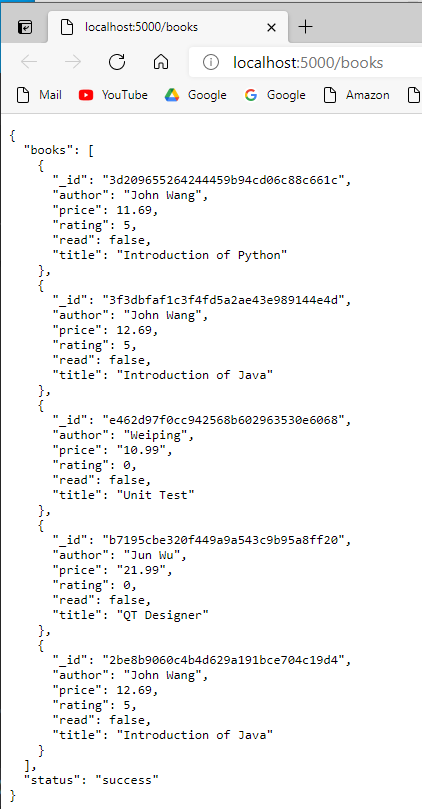

# REACT JS Learning Notes

## Select Python Interpreter
Command Palette... > Python: Select Interpreter
```json
{
    "python.pythonPath": "c:\\Users\\12818\\workspace\\python-I\\env\\Scripts\\python.exe",
    "python.formatting.provider": "yapf"
}
```
## Start Python Server
```
cd server
pip install requirements.txt
python app.py
```
[start browser](http://localhost:5000/books)



## Start ReactJS Application
```
cd book-app
npm start
```


## References
* [Build a Simple CRUD App with Python, Flask, and React](https://developer.okta.com/blog/2018/12/20/crud-app-with-python-flask-react)
* [Online Documents](https://create-react-app.dev/docs/getting-started)
* [Home Page](https://reactjs.org/)
* [Getting started](https://reactjs.org/docs/getting-started.html)
* [Call a Flask API in React](https://www.youtube.com/watch?v=06pWsB_hoD4&t=303s)
* [JSON: JavaScript Object Notation](https://www.youtube.com/watch?v=iiADhChRriM)

## Install NodeJS & npm on windows 10
[nodejs.org/en/](https://nodejs.org/en/download/)

```
node --version
npm --version
npm install -g create-react-app
create-react-app --version
```
Google Search: install reactjs on windows 10
[Step by step](https://www.liquidweb.com/kb/install-react-js-windows/)

## Start from scratch
```
sudo npx create-react-app book-app
sudo chown -R wangqianjiang book-app
cd book-app
npm start
```
You need change ownership for all all files under the book-app folder because you need make change on those source code. where 'wangqianjiang' is owner of my laptop.

## Install pip
```sh
phthon3 get-pip.py
```

## Install UI
```
npm i semantic-ui-react 
npm install semantic-ui-css 
```
add the followin line in index.js
```js
import 'semantic-ui-css/semantic.min.css'
```

add oneline in package.json
```json
  "eslintConfig": {
    "extends": "react-app"
  },
  "proxy":"http://localhost:5000",
  "browserslist": {
    "production": [
      ">0.2%",
      "not dead",
      "not op_mini all"
    ],
```

install react bootstrap
```bash
npm install react-bootstrap bootstrap
npm i history
npm i react-router-dom
```